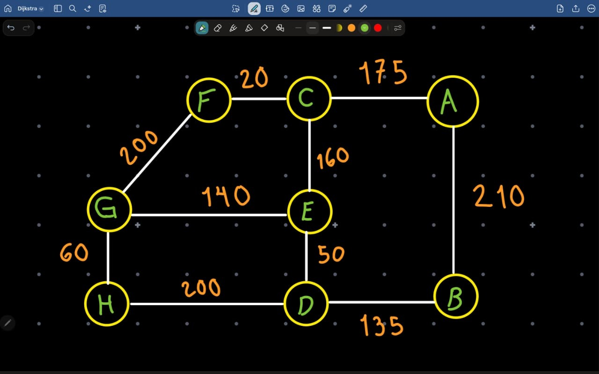
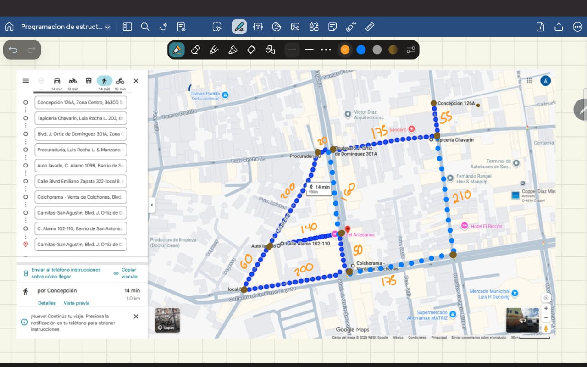

# 🚗 Algoritmo de Dijkstra — Rutas más Cortas en un Grafo Real

## 🎯 Objetivo
Implementar el **algoritmo de Dijkstra** para encontrar las rutas más cortas en un grafo con **al menos 7 nodos**, donde los **pesos representan las distancias reales** entre ubicaciones obtenidas con **Google Maps**.

---

## 🧩 Descripción del Proyecto

Este proyecto implementa un grafo **no dirigido** en C++ utilizando una **lista de adyacencia**, donde cada nodo representa una ubicación real y cada arista indica la distancia (en metros o kilómetros) entre ellas.  
El programa permite:

- Seleccionar un **nodo origen**.  
- Calcular las **distancias mínimas** a todos los demás nodos.  
- Mostrar la **ruta más corta y la distancia total** hacia los destinos seleccionados.  

La estructura y los resultados se muestran en consola.

---
## 🗺️ Diseño del Grafo

Se seleccionaron **8 ubicaciones (A–H)** cercanas entre sí y se midieron las distancias reales mediante la herramienta  
**“Medir distancia” de Google Maps**.  
Estas distancias fueron asignadas como **pesos** a las aristas del grafo.

Ejemplo de conexiones:
| Conexión | Distancia (m) |
|-----------|----------------|
| A — C | 175 |
| C — F | 20 |
| F — G | 200 |
| A — B | 210 |
| C — E | 160 |
| E — D | 50 |
| D — B | 135 |
| D — H | 200 |
| E — G | 140 |
| G — H | 60 |

---
## 🖼️ Representación del Grafo

A continuación se muestra el diagrama del grafo utilizado, con los nodos (A–H) y las distancias medidas con Google Maps:

## 🧠 Algoritmo de Dijkstra

El algoritmo de Dijkstra se utiliza para determinar las **distancias mínimas** desde un nodo origen a todos los demás nodos del grafo.  
Se basa en el principio de **relajación**, que actualiza las distancias si se encuentra un camino más corto hacia un nodo vecino.

### 🔍 Proceso General:
1. Se inicializan todas las distancias con un valor infinito (`INF`).
2. La distancia del nodo origen se establece en `0`.
3. Se usa una **cola de prioridad (min-heap)** para seleccionar el nodo con la distancia mínima actual.
4. Se recorren sus vecinos y se actualizan las distancias si se encuentra un camino más corto.
5. Se repite el proceso hasta visitar todos los nodos.

---

## 🧱 Estructura de Datos Utilizada

- **Lista de Adyacencia:**  
  Implementada mediante `map<string, vector<pair<int, string>>>`  
  Permite representar el grafo de manera eficiente en memoria.
  
- **Cola de Prioridad (Min-Heap):**  
  Implementada con `priority_queue<Arista, vector<Arista>, greater<Arista>>`  
  Se utiliza para seleccionar el nodo con menor distancia pendiente por visitar.

---

## 🧮 Métodos Principales

| Método | Descripción |
|--------|--------------|
| `add_edge(u, v, weight)` | Agrega una conexión bidireccional entre los nodos `u` y `v`. |
| `print_graph()` | Muestra la estructura del grafo con sus conexiones y pesos. |
| `dijkstra(start)` | Aplica el algoritmo de Dijkstra desde el nodo `start` y devuelve las distancias mínimas. |
| `print_shortest_path(dest, distances, prev)` | Muestra la ruta óptima y la distancia total hacia el destino `dest`. |

---

## 💻 Ejecución del Programa

Al ejecutar el programa principal (`main()`), se muestran los siguientes resultados:

1. **Estructura del Grafo Inicial.**  
2. **Distancias mínimas** desde el nodo origen (`A`) hacia todos los demás.  
3. **Camino óptimo** y **distancia total** hacia tres destinos diferentes:  
   - `H` (destino final)  
   - `E`  
   - `B`  

Ejemplo de salida:

---

## 🧪 Pruebas de Funcionalidad

A continuación se muestra el código utilizado para realizar las pruebas del algoritmo de Dijkstra.  
El programa construye el grafo, ejecuta el algoritmo desde el nodo A y muestra las rutas más cortas.

### 📘 Ejemplo de Ejecución (`main.cpp`)

🧱 1. Visualización del Grafo
Antes de aplicar el algoritmo, el programa imprime la estructura del grafo (lista de adyacencia):

📝 Estructura del Grafo (8 Nodos: A–H) 

  Nodo A: (C, 175m) (B, 210m)
  Nodo B: (A, 210m) (D, 135m)
  Nodo C: (A, 175m) (F, 20m) (E, 160m)
  Nodo D: (E, 50m) (B, 135m) (H, 200m)
  Nodo E: (C, 160m) (D, 50m) (G, 140m)
  Nodo F: (C, 20m) (G, 200m)
  Nodo G: (F, 200m) (E, 140m) (H, 60m)
  Nodo H: (D, 200m) (G, 60m)

⚙️ 2. Ejecución del Algoritmo (Nodo Origen: A)
Se aplicó el algoritmo de Dijkstra con el nodo origen A.
El programa muestra las distancias mínimas calculadas hacia cada nodo.

### 📍 Resultados de Dijkstra (Origen: A) ###

**Distancia Mínima a Cada Nodo:**
  - Nodo A: 0m
  - Nodo B: 210m
  - Nodo C: 175m
  - Nodo D: 260m
  - Nodo E: 335m
  - Nodo F: 195m
  - Nodo G: 395m
  - Nodo H: 455m
✅ Se observa que el algoritmo identifica correctamente las distancias acumuladas, partiendo desde A hasta todos los demás nodos.

🧭 3. Caminos Óptimos y Distancias Totales
El programa muestra el camino más corto y la distancia total hacia tres destinos: H, E y B.
**Rutas Más Cortas (Camino Óptimo y Distancia Total):**

  - Destino H:
      -> Ruta: A -> C -> E -> G -> H
      -> Distancia Total: 455m

  - Destino E:
      -> Ruta: A -> C -> E
      -> Distancia Total: 335m

  - Destino B:
      -> Ruta: A -> B
      -> Distancia Total: 210m
📍 Interpretación:
El algoritmo determinó correctamente que:

La ruta más corta de A a H pasa por los nodos intermedios C, E y G.

A E y B se llega directamente o con pocas conexiones.

---
## 📹 Video Explicativo

🎥 **Enlace al video en YouTube:**  
👉 [Agregar aquí el enlace del video de demostración](https://youtu.be/)

---

## 👩‍💻 Autores

| Nombre completo | Matrícula |
|-----------------|------------|
| **Ángel Landín López** | A00574700 |
| **Ángeles Araiza García** | A00574806 |
| **Carlos Andrés Gloria Cortes** | A00574714 |
| **Mónica Isabel Torres García** | A00573457 |

---

## 📚 Referencias

- Dijkstra, E. W. (1959). *A Note on Two Problems in Connexion with Graphs*.  
  Numerische Mathematik, 1, 269–271.  
- Documentación de C++ STL (`<map>`, `<vector>`, `<queue>`).  
- [Google Maps – Medir distancia](https://www.google.com/maps)

---

